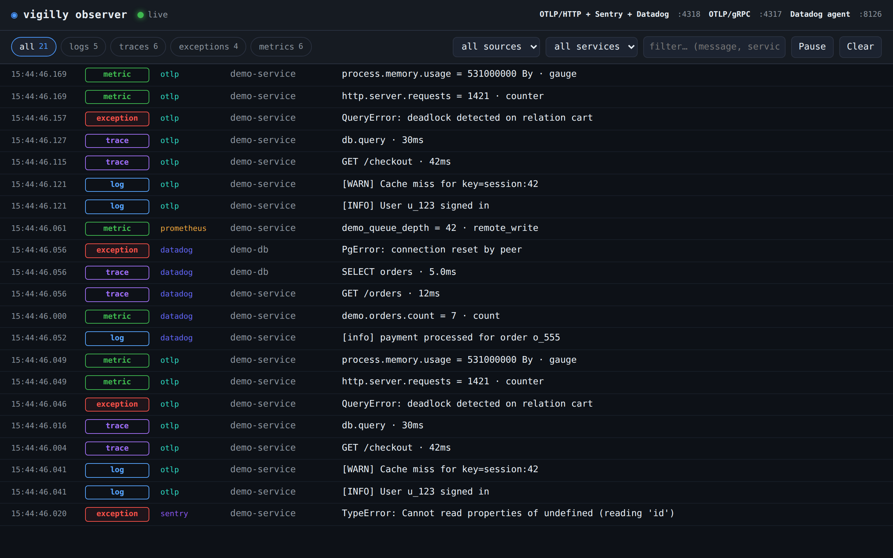

# vigilly observer

**See what your app is emitting — live.** A tiny zero-config CLI you run next to a
[vigilly](https://vigilly.dev)-instrumented service to watch its **logs, traces,
exceptions, and metrics** stream into a simple web UI in real time — before any of it
leaves for the cloud.

[](https://github.com/vigilly/observer-test/actions/workflows/ci.yml)




Point your app at `localhost` instead of vigilly's ingest, open the UI, and everything it
sends shows up instantly. It's a local mirror of what vigilly would receive — perfect for
**checking your instrumentation actually works** while you develop.

## Why

Wiring up telemetry is fiddly, and "is it even being sent?" is annoyingly hard to answer.
`vigilly observer` gives you an immediate, honest view: it stands up a local endpoint that
speaks the same protocols vigilly does, decodes whatever your app sends, and shows it.

Because vigilly is **Sentry-, OpenTelemetry-, Datadog-, and Prometheus-compatible**, so is
the observer — no matter how your service is instrumented, it just works.

## Features

- 🔴 **Live stream** of logs, traces, exceptions, and metrics over Server-Sent Events
- 🧩 **Every protocol**: OTLP (HTTP + gRPC), Sentry envelopes, Datadog, Prometheus
- 🔎 **Filter & search** by signal, source, or service; click any row for the full payload
- 🧪 **`demo` command** emits sample telemetry over every protocol — try it with zero setup
- 🪶 **Lightweight**: a single command, in-memory only, nothing is stored or forwarded

## Quick start

No install, no clone — run it directly with npx:

```bash
npx vigilly-observer
```

(Also works straight from the repo, without npm: `npx github:vigilly/observer-test`.)

Open the printed **Web UI** URL (default <http://localhost:4318>).

Want to see it in action right now? In another terminal:

```bash
npx vigilly-observer demo
```

You'll immediately see a Sentry exception, OTLP logs/trace/metrics (over HTTP **and** gRPC),
Datadog logs/metrics/APM-trace, and a Prometheus sample land in the UI.

## Point your app here

```bash
# vigilly exceptions SDK (@vigilly/node / @vigilly/browser)
Vigilly.init({ dsn: "http://public@localhost:4318/<projectId>" })

# OpenTelemetry over HTTP (add OTEL_EXPORTER_OTLP_PROTOCOL=grpc + port 4317 for gRPC)
OTEL_EXPORTER_OTLP_ENDPOINT=http://localhost:4318

# Datadog tracer
DD_TRACE_AGENT_URL=http://localhost:8126

# Prometheus — expose /metrics and let the observer scrape it
npx vigilly-observer --scrape http://localhost:9464/metrics
```

The vigilly SDK preserves the DSN's `http` scheme and port, so envelopes tunnel to
`http://localhost:4318/api/observe/<projectId>/envelope/` — exactly what the observer listens for.

## Supported protocols

| Source | Where it listens (default) | Details |
|---|---|---|
| **Web UI** | `GET /` (4318) | live stream · filters · click-to-expand |
| **OTLP / HTTP** | `POST /v1/{traces,logs,metrics}` (4318) | JSON **and** protobuf |
| **OTLP / gRPC** | `:4317` | Trace / Logs / Metrics `Export` |
| **Sentry / vigilly** | `POST /api/observe/<projectId>/envelope/` (4318) | the `@vigilly/*` SDK tunnel target |
| **Datadog** | `/api/v2/logs`, `/api/v1/series`, `/v0.4/traces`, … (4318 **&** 8126) | logs · series · APM traces (msgpack/JSON) |
| **Prometheus** | `POST /api/v1/write` · or `--scrape <url>` | remote-write (snappy+protobuf) or scrape |

## CLI options

```
vigilly-observer [options]        start the collector + web UI
vigilly-observer demo [options]   emit sample telemetry to a running collector

  --port <n>             main HTTP port (UI, OTLP/HTTP, Sentry, Datadog, Prom RW)  [4318]
  --grpc-port <n>        OTLP/gRPC port                                            [4317]
  --dd-port <n>          Datadog agent port                                        [8126]
  --host <addr>          bind address                                              [127.0.0.1]
  --no-grpc              disable the OTLP/gRPC listener
  --no-datadog           disable the dedicated Datadog agent-port listener
  --scrape <urls>        comma-separated Prometheus /metrics URLs to scrape
  --scrape-interval <s>  scrape interval in seconds                                [10]
  --max <n>              max events kept in memory                                 [1000]
  -h, --help             show help
```

## How it works

```
┌──────────────┐   OTLP · Sentry · Datadog · Prometheus   ┌───────────────────┐
│ your service │ ───────────────────────────────────────▶ │  vigilly observer │──▶ browser UI
└──────────────┘                                          └───────────────────┘
```

Each protocol has a small parser that normalizes what it receives into one common event
shape. Events go into a bounded in-memory ring buffer and are pushed to the browser over
SSE — a freshly opened tab gets a snapshot of recent events, then live updates.

## Development

```bash
npm install      # also builds dist/ via the prepare script
npm run dev      # run from source via tsx (no build)
npm run build    # tsc -> dist/
npm test         # vitest parser tests
```

CI runs the build, tests, and an end-to-end smoke test (`scripts/smoke.mjs`) on Node 20 & 22.

## Notes

- **Local dev tool.** In-memory only — no persistence, no auth, no TLS, and nothing is
  forwarded anywhere.
- Not affiliated with Sentry, Datadog, Prometheus, or the OpenTelemetry project; it simply
  speaks their wire formats.

## License

[MIT](LICENSE) © vigilly
